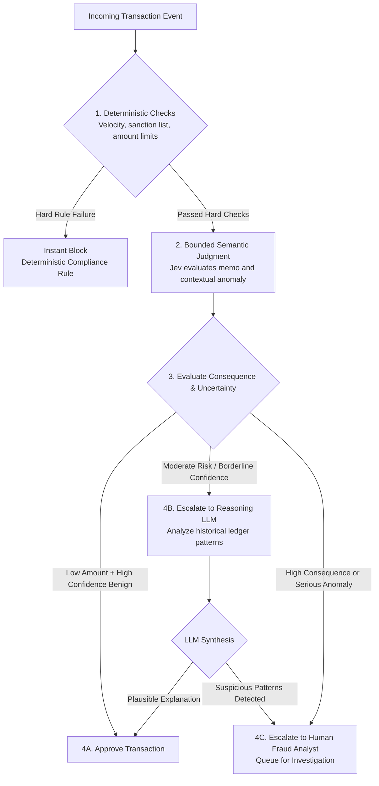

# Example 2: Financial Transaction & Fraud Triage

This worked example demonstrates how to apply the **Uncertainty vs. Consequence** governance framework to financial fraud triage, ensuring high-consequence actions (e.g., freezing accounts or blocking payments) remain under strict human authority.

---

## 1. System Topology



---

## 2. Step 1: Deterministic Invariants

Deterministic code enforces hard compliance and operational limits before involving probabilistic evaluation:

```python
# fraud_pipeline/deterministic_filter.py

def evaluate_deterministic_rules(tx: dict) -> dict:
    # 1. Sanctions list / OFAC matching (Exact database lookup)
    if is_sanctioned_entity(tx["recipient_account"]):
        return {"decision": "REJECT", "reason": "OFAC Sanctions List Match"}

    # 2. Velocity checks (Time-series / Redis sliding window)
    recent_tx_count = get_user_tx_count_last_10_minutes(tx["user_id"])
    if recent_tx_count > 20:
        return {"decision": "TEMPORARY_RATE_LIMIT", "reason": "Velocity limit exceeded"}

    # 3. Currency / country constraints
    if tx["currency"] not in SUPPORTED_CURRENCIES:
        return {"decision": "REJECT", "reason": "Unsupported currency"}

    return {"decision": "PROCEED", "sanitized_state": tx}
```

---

## 3. Step 2: Bounded Semantic Assessment via Jev

When transactions pass deterministic invariants, Jev evaluates unstructured context (transaction description, user location note, merchant category mismatch):

```python
# fraud_pipeline/semantic_triage.py
from services.jev_adapter import judge

async def evaluate_transaction_semantics(tx: dict):
    state = {
        "amount_usd": tx["amount_usd"],
        "merchant_name": tx["merchant_name"],
        "memo": tx.get("memo", ""),
        "cardholder_profile": tx.get("user_profile_summary", ""),
        "device_geo": tx.get("geo_country", ""),
    }

    questions = {
        "memo_anomaly": {
            "type": "noul",
            "instructions": "Does the transaction memo suggest high-risk keywords (e.g., crypto tumblers, laundering, ransom, illegal services)?"
        },
        "behavioral_fit": {
            "type": "score",
            "instructions": "Rate how well this transaction matches the declared cardholder profile and historical habits.",
            "criteria": [
                "Completely discordant: Merchant and geography are alien to user profile.",
                "Plausible variation: Unusual location or category, but not inherently suspicious.",
                "Consistent: Typical recurring merchant or standard consumer category."
            ]
        },
        "dispute_risk": {
            "type": "noul",
            "instructions": "Is there an explicit indication that the user reported this card compromised?"
        }
    }

    return await judge(state, questions)
```

---

## 4. Step 3: Consequence-Gated Decision Matrix

Here is where the core governance rule is strictly enforced:

> **Confidence alone must never determine whether an action may be automated. Automation depends on both uncertainty and consequence.**

```python
# fraud_pipeline/policy_engine.py

async def apply_fraud_policy(tx: dict, jev_result: dict):
    answers = jev_result["answers"]
    memo_anomaly = answers["memo_anomaly"]["probability"]
    behavioral_fit = answers["behavioral_fit"]["score"]
    amount = tx["amount_usd"]

    # HIGH-CONSEQUENCE THRESHOLD: Transactions over $10,000 USD
    is_high_consequence = amount >= 10_000

    # DANGER SCENARIO: Model reports 98% confidence that a $50,000 transaction is fraudulent.
    # POLICY RULE: We DO NOT automatically freeze the user's entire account solely on model output.
    # Freezing an account causes severe consumer and legal harm if false.
    # Instead, we hold the single transaction and route to Human Fraud Investigation.
    if is_high_consequence or memo_anomaly >= 0.70:
        return {
            "action": "HOLD_FOR_HUMAN_INVESTIGATION",
            "queue": "HIGH_PRIORITY_FRAUD_DESK",
            "reasons": [
                f"Amount ${amount:,.2f} is high consequence" if is_high_consequence else None,
                f"Memo anomaly probability: {memo_anomaly:.2f}" if memo_anomaly >= 0.70 else None,
            ],
            "evidence": jev_result
        }

    # BORDERLINE / UNCERTAIN SCENARIO (Low to Moderate Amount, but ambiguous signals)
    if behavioral_fit == 1 or (0.30 <= memo_anomaly < 0.70):
        # Escalate to Reasoning LLM to synthesize past 90 days of ledger logs
        audit_synthesis = await call_reasoning_llm_for_historical_review(tx)
        if audit_synthesis["suggests_legitimate_pattern"]:
            return {
                "action": "APPROVE_WITH_FLAG",
                "notes": audit_synthesis["rationale"],
                "evidence": jev_result
            }
        else:
            return {
                "action": "ROUTE_TO_ANALYST_QUEUE",
                "notes": audit_synthesis["rationale"],
                "evidence": jev_result
            }

    # ROUTINE LOW-CONSEQUENCE + HIGH-CONFIDENCE BENIGN
    return {
        "action": "APPROVE_IMMEDIATE",
        "evidence": jev_result
    }
```

---

## 5. Architectural Takeaways

1. **High Model Confidence != Free License to Punish:** Even when Jev evaluates `memo_anomaly` at `0.99`, the policy engine places the transaction on hold and alerts a human investigator; it does not unilaterally terminate the customer relationship or confiscate funds.
2. **Reversibility as an Engineering Criterion:** Approving a $15 coffee transaction is reversible via standard chargeback; closing a corporate treasury account is difficult and damaging to reverse. Governance matches the barrier to the reversibility of the consequence.
3. **Audit Trails Protect the Business:** The complete evaluation (rules passed, Jev probabilities, reasoning LLM synthesis, analyst final sign-off) forms an immutable audit trail compliant with banking regulations.
