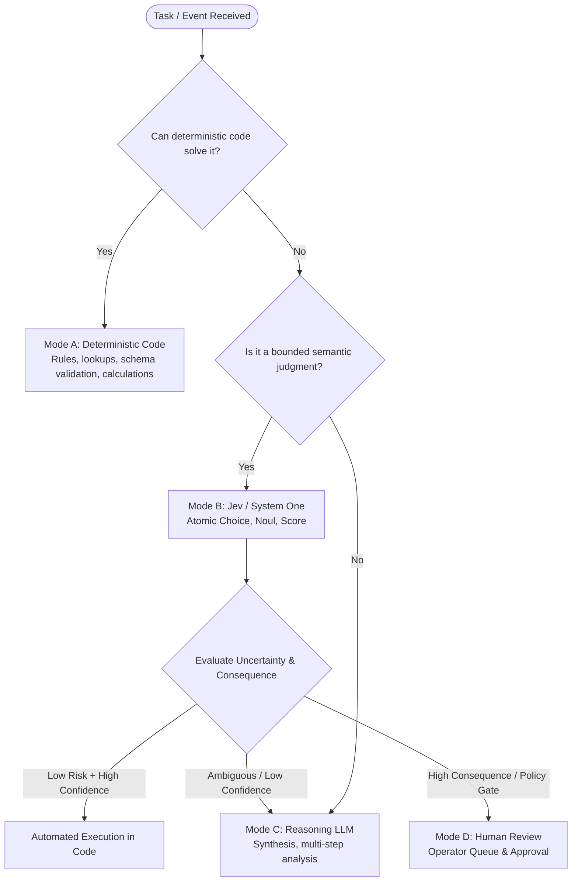

# Decision Architecture: Deterministic Code, Jev, Reasoning LLM, and Human Authority

## 1. Architectural Philosophy

The fundamental premise of this architecture is:

> **Code owns the workflow. AI supplies bounded semantic judgment where deterministic code is insufficient.**

In enterprise systems and mission-critical applications, the workflow engine (e.g., backend microservice, temporal/cadence worker, message queue consumer, or n8n workflow) retains the single source of truth for:
- State persistence and lifecycle transitions.
- Permissions, authentication, and authorization boundaries.
- Deterministic business policies and hard limits.
- Retry policies, rate limits, and idempotency keys.
- Auditing, compliance logging, and evidence records.
- Execution of irreversible actions (e.g., balance transfers, account closures, credential invalidation).

An AI model—whether a System One decision model like Jev or a frontier reasoning LLM—is a component within this system, not the sovereign orchestrator.

---

## 2. The 4-Tier Decision Hierarchy

Every decision node in a workflow must be categorized into one of four execution tiers:



---

## 3. Detailed Breakdown of the 4 Modes

### Mode A: Deterministic Code & Business Rules

Always prefer standard programming logic whenever the task can be reliably solved without probabilistic inference.

- **Characteristics:** Zero latency overhead from API calls, zero hallucination risk, 100% reproducible, fully testable with standard unit tests.
- **When to use:**
  - Exact key/value lookups (e.g., customer ID from database, session tokens).
  - Regular expressions (e.g., extracting order IDs `ORD-[0-9]{8}`, email format validation).
  - Schema and type validation (e.g., Zod, Pydantic, JSON Schema).
  - Mathematical and statistical calculations (e.g., sum of order items, SLA elapsed time).
  - Whitelist, blacklist, and blocklist filtering.
  - Role-Based Access Control (RBAC) and permission checks.
  - State machine transitions (e.g., `PENDING` -> `PROCESSING` -> `COMPLETED`).
- **Rule of Thumb:** If you can write a deterministic `if/else`, regex, or SQL query in 5 lines, **never invoke an AI model**.

### Mode B: Jev / System One (Bounded Semantic Judgment)

Use Jev when the task requires semantic understanding, but the decision space can be bounded into a discrete, typed question.

- **Characteristics:** Fast inference latency, low cost, strict schema compliance, calibrated probability distribution, no free-form text or prose generation.
- **When to use:**
  - **Category classification:** Categorizing text into known buckets (`Choice`).
  - **Proposition verification:** Evaluating boolean conditions with calibrated probabilities (`Noul`).
  - **Rubric evaluation:** Rating intensity, urgency, or alignment against defined levels (`Score`).
  - **Semantic routing:** Selecting the correct downstream processing queue or microservice.
  - **Relevance filtering:** Deciding if a retrieved document or email matches a specific intent.
- **Atomic Principle:** A Jev judgment must be narrow and focused. Do not ask Jev to simultaneously extract entities, evaluate tone, decide refund amounts, and write a polite apology. Decompose complex problems into independent atomic judgments over shared application state.

### Mode C: Reasoning / Frontier LLM

Escalate to a reasoning model (e.g., Gemini 1.5 Pro/Flash, Claude 3.5 Sonnet, GPT-4o, DeepSeek-R1) only when the problem genuinely exceeds the bounds of atomic classification.

- **Characteristics:** High semantic capacity, multi-step analytical reasoning, ability to synthesize disparate unstructured sources, high token cost, higher latency.
- **When to use:**
  - Multi-hop causal reasoning where facts must be reconciled across multiple documents.
  - Resolving conflicting semantic judgments returned by preliminary classifiers.
  - Open-ended document summarization or narrative explanation for human operators.
  - Synthesizing complex investigative dossiers (e.g., assembling evidence from 10 log files).
  - Handling novel, out-of-distribution edge cases where no predefined categories exist.
- **Constraint:** Do not make the reasoning LLM the default first step of every workflow. Use Jev as a semantic triage filter ahead of expensive frontier models.

### Mode D: Human Authority (Human-in-the-Loop)

Require human operator review whenever consequence, legal policy, or residual uncertainty demands authoritative human accountability.

- **Characteristics:** Highest reliability for subjective/ethical judgment, slowest execution, highest labor cost.
- **When to use:**
  - **High-consequence actions:** Freezing customer bank accounts, initiating legal action, medical diagnostic decisions, revoking security credentials.
  - **Irreversible state changes:** Deleting production datasets, firing webhooks that trigger irreversible physical or financial side effects.
  - **Ambiguity on sensitive axes:** Cases where both Jev and reasoning LLMs report high uncertainty or contradictory interpretations.
  - **Regulatory mandates:** Decisions subject to legal compliance requiring human contestability (e.g., GDPR Article 22, Fair Lending acts).

---

## 4. Distinguishing Uncertainty from Consequence

Workflow automation must never be decided solely on the model's confidence score:

| Scenario | Uncertainty | Consequence | Decision |
| :--- | :--- | :--- | :--- |
| **Spam Ticket Routing** | Low (Confidence: 0.96) | Low (Mistake = minor re-route) | **Automate fully** |
| **Ambiguous Category Routing** | High (Confidence: 0.52) | Low (Mistake = minor re-route) | **Escalate to Reasoning LLM** |
| **High-Risk Transaction Flag** | Low (Confidence: 0.98) | High (Freeze business account) | **Human Review Required** |
| **Conflicting Fraud Evidence** | High (Confidence: 0.55) | High (Potential $50k loss) | **Human Escalation + LLM Summary** |

---

## 5. End-to-End Workflow Architecture Pattern

When building production workflows (in Node.js, Python, Go, or n8n), structure each pipeline stage sequentially:

```text
[ Incoming Request / Event ]
            │
            ▼
1. Deterministic Preprocessing
   ├── Clean and normalize text / payload
   ├── Extract structural identifiers (Regex, UUIDs)
   └── Check schema conformance
            │
            ▼
2. Deterministic Rule Filter
   ├── Exact cache hits
   ├── Blocklist / Whitelist check
   └── Hard business invariants (e.g., account status == ACTIVE)
            │
            ▼
3. Bounded Semantic Judgment (Jev / System One)
   ├── Run atomic Choice, Noul, Score questions in parallel
   └── Collect answers, distributions, and confidence values
            │
            ▼
4. Policy Evaluation Engine (Code-Owned)
   ├── Evaluate business threshold matrix
   ├── If low consequence AND confidence >= calibrated threshold:
   │     └─► 5A. Automatic Deterministic Execution
   ├── If low consequence AND confidence < calibrated threshold:
   │     └─► 5B. Escalate to Reasoning LLM for deeper synthesis
   └── If high consequence (regardless of confidence):
         └─► 5C. Route to Human Review Queue
            │
            ▼
6. Immutable Audit Trail & Telemetry
   └── Record timestamp, input state hash, model version, provider,
       extracted features, confidence scores, policy path taken, and operator actions.
```
