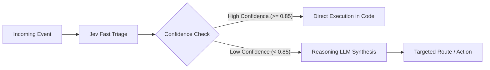

# Workflow Design Patterns & Anti-Patterns

## 1. Core Architectural Patterns

### Pattern 1: Speculative Fan-Out

When an incoming request or event might require multiple independent classifications, **send all potential questions in a single Jev request** rather than sequential round-trips.

```text
[ Incoming State ]
        │
        ├── Question 1: department (Choice)
        ├── Question 2: is_urgent (Noul)
        ├── Question 3: security_incident (Noul)
        └── Question 4: customer_sentiment (Score)
        │
        ▼ (Single HTTP Request to Jev)
[ Answers Map with Calibrated Probabilities ]
        │
        ▼ (Deterministic Business Logic evaluates answers)
```

- **Why it works:** Jev evaluates independent questions over the same state in parallel with zero extra round-trip latency.
- **Application rule:** Code inspects the results and uses branch-specific logic (e.g., if `security_incident` probability $> 0.30$, ignore `customer_sentiment` and trigger the security incident workflow).

---

### Pattern 2: Confidence-Gated Verification Cascade

Use fast System One models to handle 80-90% of routine traffic, escalating only uncertain or ambiguous outliers to a reasoning LLM or human specialist:



- **Benefits:** Massive reduction in cost (90% reduction vs. calling frontier LLMs for every event) and dramatically reduced end-to-end latency (Jev responses typically arrive in sub-second timeframes).

---

### Pattern 3: Composite Scoring with Code-Controlled Weights

Do not ask an AI model: *"Rate this transaction's fraud risk on a scale of 1 to 100 factoring in velocity, geo-ip, user history, and note tone."*

Instead, decompose the evaluation into atomic judgments and calculate the weighted composite score in deterministic code:

```typescript
// 1. Ask Jev atomic, orthogonal questions
const result = await judge(transactionState, {
  urgency_tone: { type: "score", instructions: "Evaluate panic in message tone." },
  discrepancy_claim: { type: "noul", instructions: "Does user claim they never authorized this?" },
  unusual_device: { type: "noul", instructions: "Does message mention a new device?" }
});

// 2. Deterministic code calculates composite risk
const riskScore = 
  (result.answers.urgency_tone.score * 15) +
  (result.answers.discrepancy_claim.probability * 45) +
  (result.answers.unusual_device.probability * 40);

// 3. Business code applies policy thresholds
if (riskScore >= 75) {
  routeToFraudQueue(transactionState, riskScore);
}
```

- **Why it works:** Business analysts can tune weights (e.g., changing weight from 45 to 30) without needing to re-prompt or re-train models.

---

## 2. The 5 Anti-Patterns to Strictly Avoid

### Anti-Pattern A: LLM Everywhere

```text
[Input] ──► [Frontier LLM with 2000-token prompt] ──► [JSON Parse] ──► [Action]
```

- **The Flaw:** Using an expensive, slow, high-variance frontier reasoning model to do simple binary checks, keyword lookups, or straightforward classification.
- **The Fix:** Use deterministic code for rules and exact lookups. Use Jev for bounded semantic classification. Reserve reasoning LLMs for deep synthesis.

---

### Anti-Pattern B: The Giant Semantic Prompt

```text
Prompt: "You are an enterprise AI. Classify this ticket, determine if it is urgent,
calculate the SLA deadline, write a response to the customer, check if our security policy
is violated, and output a JSON with fields: {dept, sla, email, alert_security}."
```

- **The Flaw:** Conflates classification, policy decision, calculation, and generation into a single probabilistic step. A failure in one facet invalidates the entire output.
- **The Fix:**
  1. Calculate SLA deadline with deterministic math (`Date.now() + 4 * 3600000`).
  2. Ask Jev atomic Choice for `department` and atomic Noul for `security_violation`.
  3. Execute policy in application code.

---

### Anti-Pattern C: Confidence as Sole Authorization

```text
// DANGEROUS CODE:
if (result.answers.account_ban.confidence > 0.95) {
  await database.users.delete(userId); // Irreversible high consequence!
}
```

- **The Flaw:** Assumes high model certainty equals legal, ethical, and business permission to execute irreversible, high-consequence actions.
- **The Fix:** Regardless of confidence, high-consequence operations must require human review or secondary deterministic checks.

---

### Anti-Pattern D: Provider Coupling

```text
// BAD: Spreading vendor SDK calls throughout business logic
import { TypeSafeClient } from "@typesafe-ai/sdk";
// ... later in 15 different business service files ...
const client = new TypeSafeClient({ apiKey: process.env.TYPESAFE_API_KEY });
```

- **The Flaw:** Tightly couples the entire application to one vendor's transport format. Switching to OpenRouter or an on-premise model requires refactoring dozens of files.
- **The Fix:** Wrap Jev calls in a single clean abstraction: `judge(state, questions, provider)`.

---

### Anti-Pattern E: AI for Deterministic Work

```text
// BAD: Asking AI to check email format or calculate totals
const isEmailValid = await askLLM(`Is ${email} a valid email format?`);
const orderTotal = await askLLM(`Add 10 and 25.50`);
```

- **The Flaw:** Wastes latency and money on tasks where regular expressions or standard arithmetic are 100% accurate and instantaneous.
- **The Fix:** Keep exact lookups, regexes, and calculations strictly in standard code.
